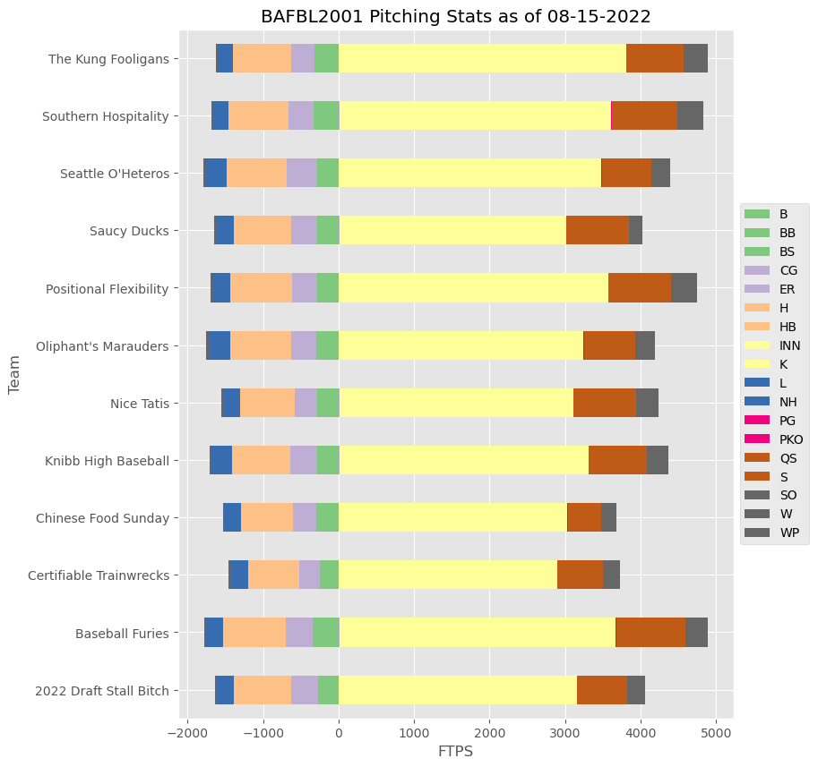
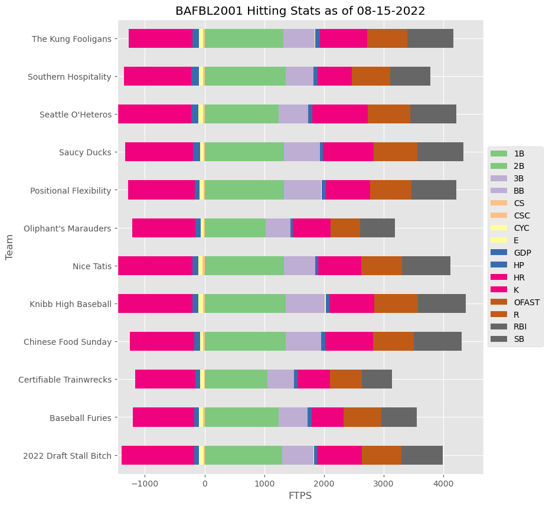

# Fantasy-Baseball
Analyzing CBS fantasy baseball stats

This is currently a work in progress, but the project scrapes data from the league's scoring stats page to plot potentially interesting data with matplotlib. 

# How to use

You just need to create a python environment from the requirements.txt file. 


To execute the script, just type the following in the root directory of this repository in your terminal:
```
python Fantasy_Baseball/
```

It will prompt you to type your league name, your username, and password. After that, it should load your league information and create graphs of your team's data from 

As usual, you should look over the script to be sure that your information is safe and not being hijacked by me or anyone else. 

If you want, you can also set variables in your environment so you don't have to keep typing in league name, username, and passwords.
Please only add a password variable to your account if it is unique and not used for anything else. Storing passwords as plain text in your .*profile* isn't the safest idea, so make sure it's unique. 

```
league_name = your league name xxx.baseball.cbssports.com, where xxx is league name
CBS_USERNAME = your email address for your CBS fantasy account
CBS_Password = your password for your CBS fantasy account.
```



